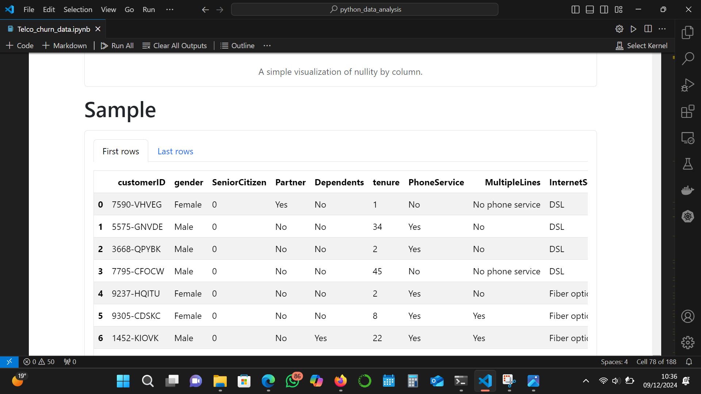

#  Telco Customer Churn Prediction 🚀  
**Leveraging Data Science to Identify and Retain Customers with Advanced Analytics**

---

## 📚 Libraries Used  
The following libraries and frameworks were used in this project:  

- **[Python](https://www.python.org/):** General-purpose programming language for data manipulation and model building.  
- **[Pandas](https://pandas.pydata.org/):** Data manipulation and analysis.  
- **[NumPy](https://numpy.org/):** Numerical computations.  
- **[SciPy](https://scipy.org/):** Statistical analysis and advanced computations.  
- **[Scikit-learn](https://scikit-learn.org/stable/):** Machine learning algorithms and utilities.  
- **[TensorFlow](https://www.tensorflow.org/):** Deep learning framework.  
- **[Keras](https://keras.io/):** High-level neural network API.  
- **[XGBoost](https://xgboost.readthedocs.io/):** Gradient boosting framework for predictive modeling.  
- **[Plotly](https://plotly.com/):** Interactive visualizations and dashboards.
---
  ## 📌 Problem Statement  

Telecommunication companies face a significant challenge: customer churn. **Churn** refers to the loss of customers who discontinue using a service. This can result in substantial revenue loss, especially for businesses offering essential services like **phone, internet, television**, and **streaming**.  

In this project, we aim to help **Telco**, a leading telecommunications provider, accurately predict **customer churn**. By identifying customers at risk of leaving, the company can implement strategic plans to improve retention, provide personalized offers, and enhance customer satisfaction.  

With advanced analytics and machine learning, **Telco** can turn data into actionable insights, keeping customers connected and improving overall business outcomes. 

---

---
### Machine Learning: Predicting Customer Churn  

In today's competitive telecom industry, customer retention is crucial. Telco serves a diverse range of customers who subscribe to its services. However, predicting whether a customer will churn (discontinue the service) within a few days can offer a significant edge. By analyzing key factors such as **billing preferences**, **age**, and **relationship status**, we can uncover patterns that lead to churn and identify opportunities to prevent it.  

Imagine being able to proactively address these issues before customers decide to leave. By understanding what drives customer behavior, Telco can design personalized plans and services to keep customers engaged.  

### Why Does It Matter?  
A deeper analysis of influential factors like payment methods, contract terms, and customer demographics can help businesses:  
- **Retain Existing Customers**: Build loyalty by addressing churn-inducing pain points.  
- **Attract New Customers**: Implement strategies that target the needs of prospective customers.  
- **Maximize Revenue**: Retention-focused approaches lead to long-term profitability and sustainable growth.  

With machine learning and data analysis, Telco can transform insights into actionable strategies, ensuring customers not only stay but also recommend their services to others.

---
# 🔍 Exploratory Data Analysis (EDA)

Exploratory Data Analysis (EDA) is an essential step in understanding the dataset. It helps uncover hidden patterns, detect anomalies, test hypotheses, and check assumptions with the help of summary statistics and graphical representations.

### Key Insights:
* The total monthly charges for customers who did not churn ("No") are significantly higher than those for customers who churned ("Yes").
* The TotalCharges for Fiber Optic users are significantly higher than DSL users. This indicates Fiber Optic is the primary revenue driver and is valued more by customers.
* The total charges for Paperless Billing customers are 306,792.80 compared to 149,323.80 for non-Paperless Billing customers. This suggests that Paperless Billing might be associated with higher-value services or plans.
* Since we got a statically significant result , it means the Customers who dont churn are performing way better than those who churn
---
## Metrics Used

In this project, we evaluate the performance of our model using the following metrics:

- **Accuracy**: The ratio of correct predictions to the total number of predictions.
  [Learn more](https://scikit-learn.org/stable/modules/generated/sklearn.metrics.accuracy_score.html)
  
- **Classification Report**: Provides a detailed summary of precision, recall, f1-score for each class.
  [Learn more](https://scikit-learn.org/stable/modules/generated/sklearn.metrics.classification_report.html)
  
- **Confusion Matrix**: A table used to describe the performance of a classification algorithm.
  [Learn more](https://scikit-learn.org/stable/modules/generated/sklearn.metrics.confusion_matrix.html)
  
- **ROC Score**: The Receiver Operating Characteristic curve shows the tradeoff between true positive rate and false positive rate.
  [Learn more](https://scikit-learn.org/stable/modules/generated/sklearn.metrics.roc_auc_score.html)
  
- **ROC Curve**: A graphical representation of the diagnostic ability of a binary classifier system.
  [Learn more](https://scikit-learn.org/stable/modules/generated/sklearn.metrics.roc_curve.html)

---
## Models Used

In this project, we utilized the following machine learning models to predict customer churn:

- **Logistic Regression**: A statistical method for binary classification, used for predicting the probability of a binary outcome.
  [Learn more](https://scikit-learn.org/stable/modules/generated/sklearn.linear_model.LogisticRegression.html)
  
- **Support Vector Classifier (SVC)**: A supervised machine learning algorithm for classification, which works by finding the hyperplane that best divides the data.
  [Learn more](https://scikit-learn.org/stable/modules/generated/sklearn.svm.SVC.html)
  
- **Random Forest Classifier**: An ensemble learning method based on decision trees, used to improve classification accuracy by combining multiple trees to reduce overfitting.
  [Learn more](https://scikit-learn.org/stable/modules/generated/sklearn.ensemble.RandomForestClassifier.html)
  
- **CatBoost Classifier**: A gradient boosting algorithm that is designed to handle categorical data efficiently and achieve high accuracy with less tuning.
  [Learn more](https://catboost.ai/docs/)
  
- **XGBoost Classifier**: A scalable, distributed gradient boosting library that is known for its speed and performance in machine learning competitions.
  [Learn more](https://xgboost.readthedocs.io/en/latest/)

  ---
  ## Visualizations

In this section, we showcase the key visualizations that play a crucial role in the journey of understanding our data. From exploratory data analysis (EDA) to feature engineering and the predictions of our machine learning models, these visualizations help us make sense of complex information. They not only provide deeper insights into the data but also guide us in making better decisions on how to build and refine our models.

One of the images here gives us a clear view of the input data, highlighting a few of the most important features and attributes that machine learning models use to predict customer churn. This is the heart of our data: a collection of attributes that, when well-understood, help us craft more accurate models and enhance the performance of our predictions.

It’s important to note that while this image illustrates only a selection of features, our dataset contains many more. However, these are the key highlights to show the potential of what we can achieve with the right understanding and approach.

---

---
We can now understand the total number of missing values from each of the features. Missingno plots from the Pandas Profiler can be used to show a list of missing values from the features. It clearly indicates that there are less number of missing values in the data.

  
